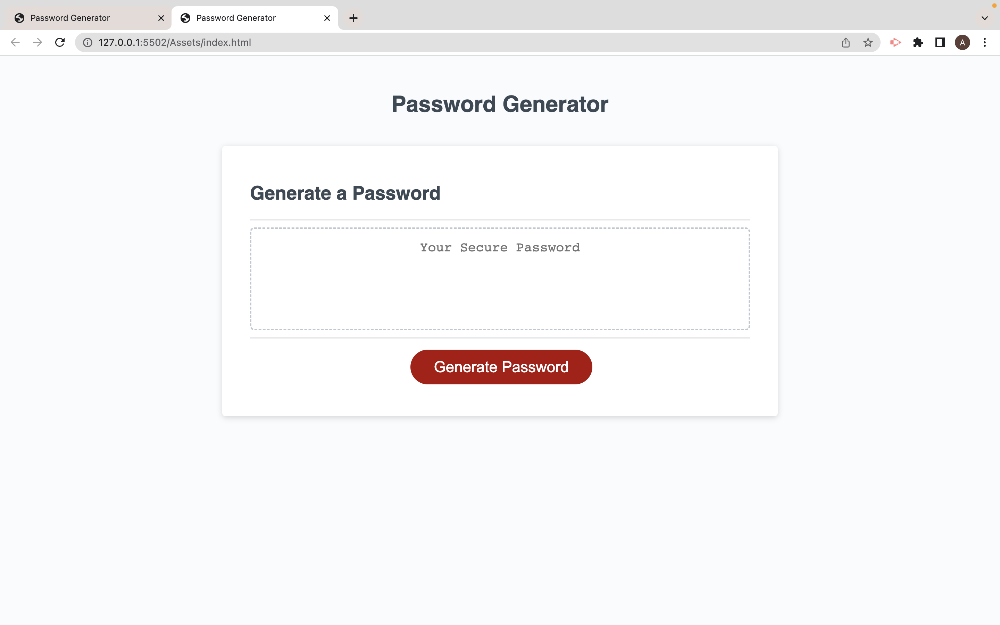
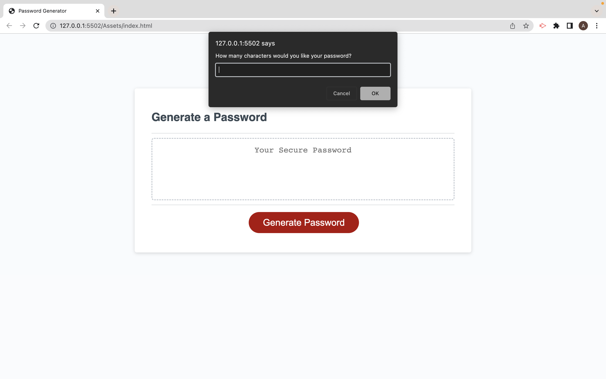
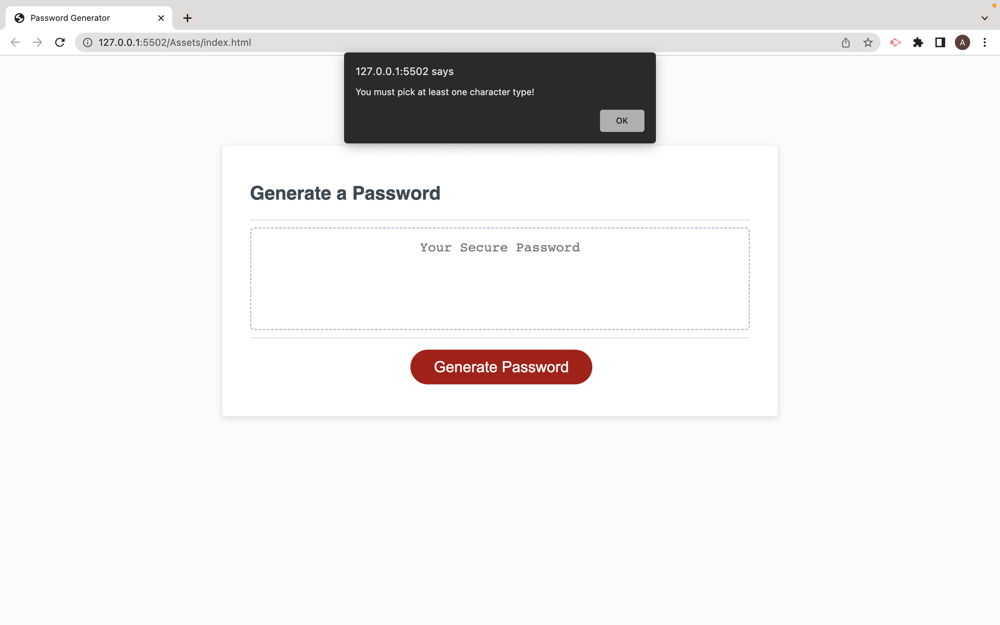
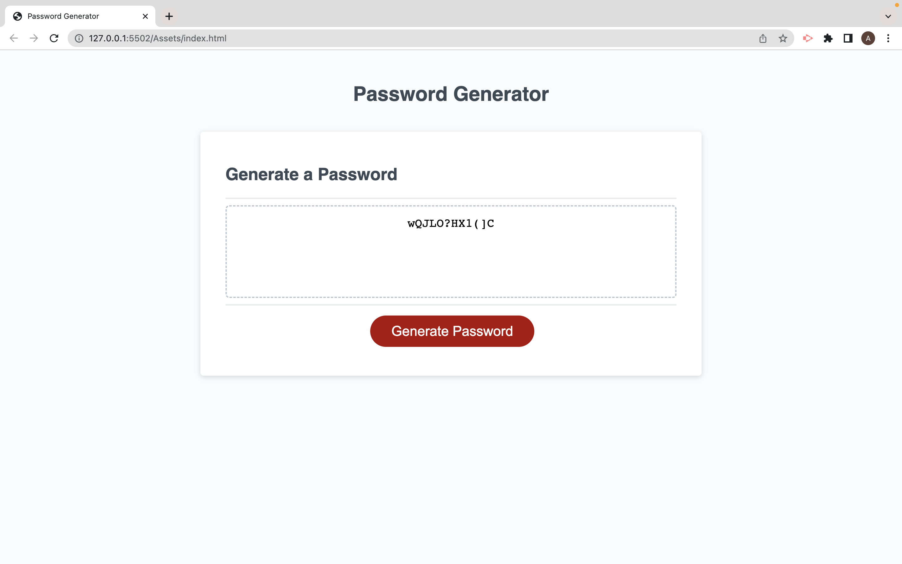

# week-3-passwordgenerator

Customer asked for a page that created a password using random characters.

## User Story

- As a developer I want a page that is interactive using Java Script to allow users to interact with the web page. 

- So that the user is able to use the site to customize their own random password with picked choices. 

## Acceptance Criteria

- GIVEN page that is interactive with the user to generate a random password 

- WHEN JS elements are understood across search engines to allow for interaction 

- WHEN a user receives prompts for password, length, Cases, special character 

- WHEN a user is asked, they should be forced to pick at least one character 

- WHEN a user uses a length is should be between 8 - 128 characters 

- WHEN page allows for smooth navigation for the user 

- WHEN page When JS, CSS and HMTL link up accordingly with the page 

- WHEN user runs through questions and passes the acceptance criteria to generate a password then they should be present with a new random password  

 
 

My main issue was ensuring my syntax in java script was compatible with what I wanted the page to do in the web browser. My main issue was ensuring that the users options fit into the criteria that was needed. By preventing the user from typing in letters when prompted for the password length and also ensuring that the user used 8 - 128 characters. 

 

## General info
This is a page developed through HTML and later styled through CSS. The main functionality of the page comes from Java Script which allows for the interactivity by the user into the page to randomly generate a password. The user is given a list of questions to selected from to generate their ideal random password. However, there are set criteria that the user will have to meet to be able to set up a password such as ensuring that the password length is greater than 8, less than 128, that they pick at least one character type and that when entering a number into the generator it is done using numeric characters. 
## Page link
https://adibasjd.github.io/Week-3-password-generator/

## MY WEB PAGE
Password generator presented to user

User is promoted for a password length

User is asked what chacaters they would like to use from the generator however if the user does not pick a charcter they will be promoted to pick one.

User is asked to pick a chacacter length that is more than 8 and less than 128. if they do not meet this criteria they will be promted to pick an exceptable password length.
The user must use a number and not text tp put in a password length if this is not done an error will return.

A random password is generated
